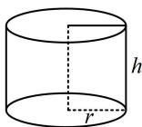

> [!faq]- 《第1节 几何体的表面积与体积》参考答案
>
> > [!success]- **【答案】** $24\pi$
>
> > [!note]- **【分析】**
> > 本题未单列分析。
>
> > [!note]- **【解析】**
> > 解析：如图，由题意， $h = 4$ ，底面积 $S = \pi r^2 = 9\pi$
> >
> > 所以 r=3 ，故圆柱的侧面积为 $2\pi rh=24\pi$ .
> >
> > 
