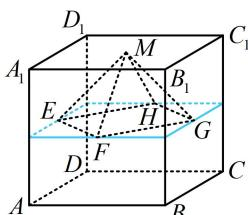

> [!faq]- 《第1节 几何体的表面积与体积》参考答案
>
> > [!success]- **【答案】** $\frac{1}{12}$
>
> > [!note]- **【分析】**
> > 本题未单列分析。
>
> > [!note]- **【解析】**
> > 解析：如图，四棱锥 $M - EFGH$ 的高为 $\frac{1}{2}$ ，底面是由蓝色正方形各边中点连线而成的正方形，其边长为 $\frac{\sqrt{2}}{2}$ ，所以 $V_{M - EFGH} = \frac{1}{3} \times \left(\frac{\sqrt{2}}{2}\right)^2 \times \frac{1}{2} = \frac{1}{12}$ .
> >
> > 
