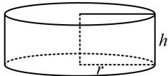
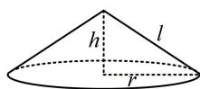

> [!faq]- 《第1节 几何体的表面积与体积》参考答案
>
> > [!success]- **【答案】** B
>
> > [!note]- **【分析】**
> > 本题未单列分析。
>
> > [!note]- **【解析】**
> > 解析：求圆锥的体积还差底面半径 $r$ ，我们先翻译已知的侧面积相等，建立方程求 $r$ 如图，圆柱和圆锥的高都为 $h = \sqrt{3}$ ，底面半径都是 $r$ 则圆锥的母线长 $l = \sqrt{h^2 + r^2} = \sqrt{3 + r^2}$ 又因为它们的侧面积相等，所以 $2\pi rh = \pi rl$ 从而 $2\pi r\cdot \sqrt{3} = \pi r\sqrt{3 + r^2}$ ，故 $r = 3$
> >
> > 所以圆锥的体积 $V = \frac{1}{3}\pi r^2 h = \frac{1}{3}\pi \times 3^2 \times \sqrt{3} = 3\sqrt{3}\pi$
> >
> > 
> >
> > 
