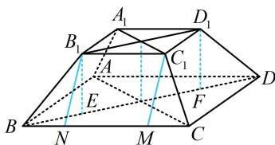

> [!faq]- 《第1节 几何体的表面积与体积》参考答案
>
> > [!success]- **【答案】** $\frac{28\sqrt{2}}{3}$ ; $12\sqrt{3}$
>
> > [!note]- **【分析】**
> > 本题未单列分析。
>
> > [!note]- **【解析】**
> > 解析：要算正四棱台的体积，还差高，已知侧棱长，可在包含侧棱的截面 $BDD_{1}B_{1}$ 中来分析，如图，作 $B_{1}E \perp BD$ 于 $E$ ， $D_{1}F \perp BD$ 于 $F$ ，则 $B_{1}E$ ， $D_{1}F$ 均为正四棱台的高，由题干所给数据可求得 $BD = 4\sqrt{2}$ ， $B_{1}D_{1} = 2\sqrt{2}$ ，所以 $EF = B_{1}D_{1} = 2\sqrt{2}$ ， $BE = DF = \frac{1}{2}(BD - EF) = \sqrt{2}$ ，从而 $B_{1}E = \sqrt{BB_{1}^{2} - BE^{2}} = \sqrt{2}$ ，故正四棱台的体积 $V = \frac{1}{3} \times (2 \times 2 + 4 \times 4 + \sqrt{2 \times 2 \times 4 \times 4}) \times \sqrt{2} = \frac{28\sqrt{2}}{3}$ ；再算侧面积，侧面为四个全等的等腰梯形，上底和下底已知，还差高，故先算高，如图，作 $C_{1}M \perp BC$ 于 $M$ ， $B_{1}N \perp BC$ 于 $N$ ，则 $MN = B_{1}C_{1} = 2$ ， $CM = BN = \frac{1}{2}(BC - MN) = 1$ ， $B_{1}N = \sqrt{BB_{1}^{2} - BN^{2}} = \sqrt{3}$ ，所以等腰梯形 $BCC_{1}B_{1}$ 的面积为 $\frac{1}{2} \times (2 + 4) \times \sqrt{3} = 3\sqrt{3}$ ，故四棱台的侧面积 $S = 4 \times 3\sqrt{3} = 12\sqrt{3}$ 。
> >
> > 
