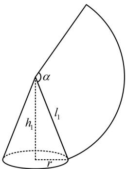
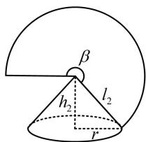

> [!faq]- 《第1节 几何体的表面积与体积》参考答案
>
> > [!success]- **【答案】** B
>
> > [!note]- **【分析】**
> > 本题未单列分析。
>
> > [!note]- **【解析】**
> > 解析：两个圆锥及其侧面展开示意图如图，
> >
> > 要研究体积之比，需分析关键参数（底面半径和高）的比值，先翻译已知条件，
> >
> > 由题意， $\frac{S_{\text{甲}}}{S_{\text{乙}}} = \frac{\pi r l_1}{\pi r l_2} = \frac{l_1}{l_2} = 2$ ，所以 $l_{1} = 2l_{2}$ ①，还有侧面展开图的圆心角之和为 $2\pi$ 没翻译，故又来翻译它，设甲、乙两个圆锥的侧面展开图的圆心角分别为 $\alpha$ ， $\beta$ 则 $\left\{ \begin{array}{l}\alpha l_1 = 2\pi r\\ \beta l_2 = 2\pi r \end{array} \right.\Rightarrow \alpha +\beta = \frac{2\pi r}{l_1} +\frac{2\pi r}{l_2} = 2\pi \Rightarrow \frac{r}{l_1} +\frac{r}{l_2} = 1,$ 结合①可得 $l_{1} = 3r$ ， $l_{2} = \frac{3r}{2}$ ，所以 $h_1 = \sqrt{l_1^2 - r^2} = 2\sqrt{2} r$ ， $h_2 = \sqrt{l_2^2 - r^2} = \frac{\sqrt{5}r}{2}$ 故 $\frac{V_{\text{甲}}}{V_{\text{乙}}} = \frac{\frac{1}{3}\pi r^2h_1}{\frac{1}{3}\pi r^2h_2} = \frac{h_1}{h_2} = \frac{2\sqrt{2}r}{\frac{\sqrt{5}}{2}r} = \frac{4\sqrt{10}}{5}.$
> >
> >   
> > 圆锥甲
> >
> >   
> > 圆锥乙
