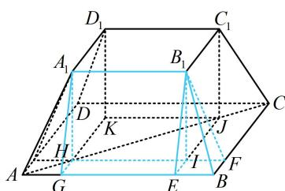

> [!faq]- 《第1节 几何体的表面积与体积》参考答案
>
> > [!success]- **【答案】** C
>
> > [!note]- **【分析】**
> > 本题未单列分析。
>
> > [!note]- **【解析】**
> > 解析：正四棱台切割方法的示意图如图，条件给出了直三棱柱和四棱锥的体积，可考虑把计算它们需要用到的量设出来，将已知和所求都用所设变量表示，观察二者的联系，
> >
> > 设 HI = IJ = x，IE = IF = y， $A_{1}H = B_{1}I = z$ ，
> >
> > 则 $V_{B_1 - BEIF} = \frac{1}{3} y^2 z = 1$ ，所以 $y^{2}z = 3$ ①，
> >
> > 又由题意， $V_{A_1HG - B_1IE} = \frac{1}{2} xzy = 3$ ，所以 $xyz = 6$ ②，
> >
> > 正四棱台的体积 $V = 4V_{A_1HG - B_1IE} + 4V_{B_1 - BEIF} + V_{A_1B_1C_1D_1 - HIJK}$
> >
> > $$
> > = 4 \times 3 + 4 \times 1 + x ^ {2} z = 1 6 + x ^ {2} z \quad ③
> > $$
> >
> > 观察发现所求式不含 $y$ ，故考虑由①②消去 $y$ 再观察形式，
> >
> > 由②可得 $y = \frac{6}{xz}$ ，代入①得 $\frac{36}{x^2z^2} \cdot z = 3$ ，
> >
> > 所以 $x^{2}z = 12$ ，代入③得 $V = 28$
> >
> > 
