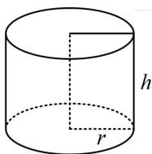
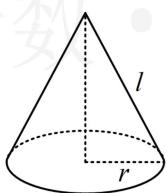
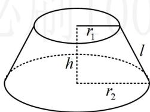
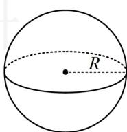

<!-- source-part:1 pages:1-5 -->

# 模块一 立体图形的结构探究

# 第1节 几何体的表面积与体积（★★）

内容提要

本节涉及空间几何体的表面积和体积计算，下面先梳理一些必备公式.

1. 多面体的表面积与体积（表面积即各个面的面积之和，没有统一的公式）

①棱锥的体积： $V=\frac{1}{3}Sh$ ；②棱柱的体积：V=Sh；③棱台的体积： $V=\frac{1}{3}(S+S'+\sqrt{SS'})h$

2. 旋转体的表面积与体积

①圆柱：如图1，体积 $V = Sh = \pi r^{2}h$ ，侧面积 $S_{\text{侧}} = 2\pi rh$ ，表面积 $S = 2\pi rh + 2\pi r^{2}$ ；

②圆锥：如图2，体积 $V=\frac{1}{3}Sh=\frac{1}{3}\pi r^{2}h$ ，侧面积 $S_{侧}=\pi rl$ ，表面积 $S=\pi rl+\pi r^{2}$ ；

③圆台：如图3，体积 $V = \frac{1}{3} (S + S' + \sqrt{SS'}) h = \frac{\pi}{3} (r_1^2 + r_2^2 + r_1 r_2) h$ ，侧面积 $S_{\text{侧}} = \pi (r_1 + r_2) l$ ，表面积 $S = \pi (r_1 + r_2) l + \pi r_1^2 + \pi r_2^2$ ;

④球：如图4，体积 $V=\frac{4}{3}\pi R^{3}$ ，表面积 $S=4\pi R^{2}$ .

  
图1

  
图2

  
图3

  
图4

![[高中/总复习/教辅/一数常规版2026/第9章 立体几何、空间向量/模块1 立体图形的结构探究/第1节 几何体的表面积与体积/类型01_简单几何体的表面积与体积/类型01_简单几何体的表面积与体积.md]]
![[高中/总复习/教辅/一数常规版2026/第9章 立体几何、空间向量/模块1 立体图形的结构探究/第1节 几何体的表面积与体积/类型02_组合体的表面积与体积/类型02_组合体的表面积与体积.md]]
![[高中/总复习/教辅/一数常规版2026/第9章 立体几何、空间向量/模块1 立体图形的结构探究/第1节 几何体的表面积与体积/强化训练/强化训练.md]]
