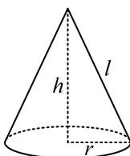

> [!faq]- 《第1节 几何体的表面积与体积》例题解析
>
> > [!success]- **【答案】** B
>
> > [!note]- **【分析】**
> > 本题未单列分析。
>
> > [!note]- **【解析】**
> > A. $8 \pi$ B. $\frac{8 \pi}{3}$ C. $2 \pi$ D. $\frac{4 \pi}{3}$
> >
> > 解析：已有底面积，算圆锥体积还差高，可由所给条件建立圆锥关键参数的方程组，
> >
> > 如图，圆锥的底面积 $S = \pi r^2 = 2\pi \Rightarrow r = \sqrt{2}$
> >
> > 圆锥的侧面积 $S' = \pi rl = \sqrt{2}\pi l = 6\pi \Rightarrow$ 母线长 $l = 3\sqrt{2}$
> >
> > 所以圆锥的高 $h = \sqrt{l^2 - r^2} = 4$ ，故体积 $V = \frac{1}{3} Sh = \frac{1}{3}\times 2\pi \times 4 = \frac{8\pi}{3}$
> >
> > 
