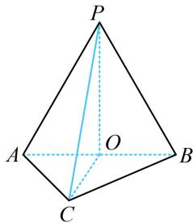

> [!faq]- 《第1节 几何体的表面积与体积》例题解析
>
> > [!success]- **【答案】** A
>
> > [!note]- **【分析】**
> > 本题未单列分析。
>
> > [!note]- **【解析】**
> > A. 1 B. $\sqrt{3}$ C. 2 D. 3
> >
> > 解析: 以 $\triangle ABC$ 为底面, 求体积还差高, 故需过 $P$ 作面 $ABC$ 的垂线, 垂足在哪儿呢? 由于 $\triangle ABP$ 和 $\triangle ABC$ 都是正三角形, 常见的作辅助线方法是取公共底边 $AB$ 的中点 $O$ , 即可找到高,
> >
> > 如图，取 $AB$ 中点 $O$ ，连接 $OC$ ， $OP$ ，则 $AB \perp OP$ ，由所给数据可求得 $OP = OC = \sqrt{3}$ 又 $PC = \sqrt{6}$ ，所以 $OP^2 + OC^2 = 6 = PC^2$ ，故 $PO \perp OC$ 结合 $PO \perp AB$ 可得 $PO \perp$ 平面 $ABC$ ，故 $PO$ 是高，所以 $V_{P - ABC} = \frac{1}{3} S_{\triangle ABC} \cdot PO = \frac{1}{3} \times \frac{1}{2} \times 2 \times 2 \times \sin 60^\circ \times \sqrt{3} = 1.$
> >
> > 
>
> > [!tip]- **【反思】**
> > - **①**：有时求体积的参数（例如本题的高）需要我们自己作出来；
> > - **②**：本题的模型很常见，我们一般称之为“双等腰三角形模型（两个等腰 $\triangle ABP$ 和 $\triangle ABC$ 共用底边 $AB$ ）．取公共底边中点，构造与底边垂直的截面（如本题的截面 $POC$ ），是这一模型中常用的添加辅助线的方法．即使本题改变 $PC$ 的长，使 $PO$ 与 $OC$ 不垂直，过 $P$ 作面 $ABC$ 的垂线，垂足也一定落在直线 $OC$ 上．后续还会多次遇见该模型.
