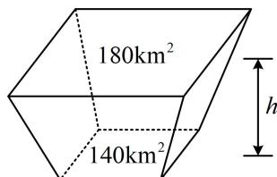

> [!faq]- 《第1节 几何体的表面积与体积》例题解析
>
> > [!success]- **【答案】** C
>
> > [!note]- **【分析】**
> > 本题未单列分析。
>
> > [!note]- **【解析】**
> > 解析：算棱台的体积，代公式即可，先找到 S 和 $S'$ ，以及棱台的高 h，
> > 如图，该棱台的两个底面面积分别为 $S = 140 km^{2}$ ， $S' = 180 km^{2}$ ，
> > 高 $h=157.5-148.5=9m=9\times10^{-3}km$ 所以棱台的体积 $V=\frac{1}{3}(S+S'+\sqrt{SS'})h=\frac{1}{3}\times(140+180+\sqrt{140\times180})\times9\times10^{-3}km^{3}$ $=3\times(320+60\sqrt{7})\times10^{-3}km^{3}\approx3\times(320+60\times2.65)\times10^{-3}km^{3}=1.437km^{3}\approx1.4\times10^{9}m^{3}$ .
> >
> >
> > 
>
> > [!tip]- **【总结】**
> > 对于简单几何体的表面积与体积，把该几何体的关键参数代入内容提要对应公式计算即可.
