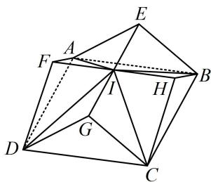
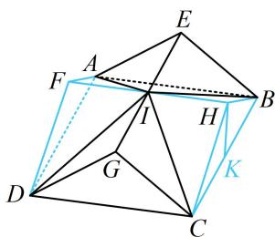

<!-- question-source:start -->
【例6】如图，某多面体是由两个直三棱柱重叠后而成，重叠后的底面为正方形，直三棱柱的底面是顶角为 $120^{\circ}$ ，腰为3的等腰三角形，则该多面体的体积为（）A. 23 B. 24 C. 26 D. 27

$$
I - A B C D
$$

$$
I - B C H
$$

$$
I - C D G, I - A B E, I - A D F
$$

$$
B C ^ {2} = B H ^ {2} + C H ^ {2} - 2 B H \cdot C H \cdot \cos \angle B H C = 3 ^ {2} + 3 ^ {2} - 2 \times 3 \times 3 \times \cos 1 2 0 ^ {\circ} = 2 7 \Rightarrow S _ {A B C D} = B C ^ {2} = 2 7
$$

$$
C D \perp H K
$$

$$
B H C - A F D
$$

$$
H K = C H \cdot \sin \angle H C K = 3 \sin 3 0 ^ {\circ} = \frac {3}{2}
$$

$$
C D \perp
$$

即正四棱锥 $I - ABCD$ 的高为 $\frac{3}{2}$ ，所以 $V_{I - ABCD} = \frac{1}{3} \times 27 \times \frac{3}{2} = \frac{27}{2}$ ；

再求三棱锥 $I - CDG$ 的体积，这部分天然就有 $IG \perp$ 平面 $CDG$ ， $V_{I - CDG} = \frac{1}{3} S_{\triangle CDG} \cdot IG = \frac{1}{3} S_{\triangle CDG} \cdot \frac{1}{2} BC = \frac{1}{3} \times \frac{1}{2} \times 3 \times 3 \times \sin 120^{\circ} \times \frac{1}{2} \times 3\sqrt{3} = \frac{27}{8}$ ，所以整个几何体的体积 $V = V_{I - ABCD} + 4V_{I - CDG} = \frac{27}{2} + 4 \times \frac{27}{8} = 27$ 。

<!-- question-source:end -->

![[高中/总复习/教辅/一数常规版2026/第9章 立体几何、空间向量/模块1 立体图形的结构探究/第1节 几何体的表面积与体积/类型02_组合体的表面积与体积/例题/answers/Q00050504A1.md]]
