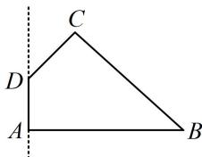
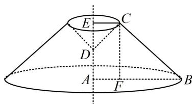

> [!faq]- 《第1节 几何体的表面积与体积》例题解析
>
> > [!success]- **【答案】** C
>
> > [!note]- **【分析】**
> > 本题未单列分析。
>
> > [!note]- **【解析】**
> > A. $(6 + 4\sqrt{2})\pi$ B. $(9 + 4\sqrt{2})\pi$ C. $(9 + 9\sqrt{2})\pi$ D. $(9 + 10\sqrt{2})\pi$
> >
> > 
> >
> > 解析：原图形绕 $AD$ 旋转一周得到的几何体如图，它是一个圆台在上方挖去了一个圆锥后余下的部分，该组合体的表面积由三部分构成，下方的圆，中间圆台的侧面，上方挖去的圆锥的侧面，需分别计算，由题意， $\angle CDE = 180^{\circ} - \angle ADC = 45^{\circ}$ ，所以 $CE = DE = \frac{\sqrt{2}}{2} CD = 1$ ， $AF = 1$ ， $BF = AB - AF = 2$ ，
> >
> > 由题意， $\angle CDE = 180^{\circ} - \angle ADC = 45^{\circ}$ ，所以 $CE = DE = \frac{\sqrt{2}}{2} CD = 2\sqrt{2}$ $CF = AE = AD + DE = 2$ ， $BC = \sqrt{CF^2 + BF^2} = \sqrt{2^2 + 2^2} = 2\sqrt{2}$ 图中圆 $A$ 的面积为 $S_{1} = \pi \times 3^{2} = 9\pi$ 圆台的侧面积 $S_{2} = \pi (CE + AB)\cdot BC = \pi \times (3 + 1)\times 2\sqrt{2} = 8\sqrt{2}\pi$ 上方挖去的圆锥的侧面积 $S_{3} = \pi \cdot CE\cdot CD = \sqrt{2}\pi$ 故所求表面积为 $S_{1} + S_{2} + S_{3} = (9 + 9\sqrt{2})\pi .$
> >
> > 
