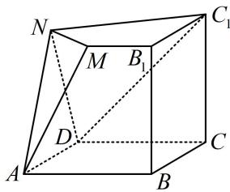
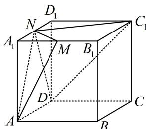

> [!faq]- 《第1节 几何体的表面积与体积》例题解析
>
> > [!success]- **【答案】** C
>
> > [!note]- **【分析】**
> > 本题未单列分析。
>
> > [!note]- **【解析】**
> > A. 5 B. 6 C. 7 D. 8
> >
> > 
> >
> > 解析：所给几何体由正方体截得，故先画出完整的正方体，再看怎样算体积，如图，截去的部分是三棱锥 $A - A_{1}MN$ 和 $D - C_{1}D_{1}N$ ，正方体的体积 $V = 2^{3} = 8$ ， $V_{A - A_{1}MN} = \frac{1}{3} S_{\triangle A_{1}MN} \cdot AA_{1} = \frac{1}{3} \times \frac{1}{2} \times 1 \times 1 \times 2 = \frac{1}{3}$ ， $V_{D - C_{1}D_{1}N} = \frac{1}{3} S_{\triangle C_{1}D_{1}N} \cdot DD_{1} = \frac{1}{3} \times \frac{1}{2} \times 2 \times 1 \times 2 = \frac{2}{3}$ ，故所求几何体的体积为 $8 - \frac{1}{3} - \frac{2}{3} = 7$ 。
> >
> > 
