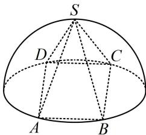

<!-- question-source:start -->
1. (2023·天津模拟·★★)

如图，半球内有一内接正四棱锥 $S - ABCD$ ，该四棱锥的体积为 $\frac{4\sqrt{2}}{3}$ ，则该半球的体积为（ ）A. $\frac{\sqrt{2}}{3}\pi$ B. $\frac{4\sqrt{2}}{9}\pi$ C. $\frac{4\sqrt{2}}{3}\pi$ D. $\frac{8\sqrt{2}}{3}\pi$

<!-- question-source:end -->

![[Q00050522A1]]
