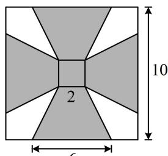

<!-- question-source:start -->
7. (2023·云南红河州一模·★★★)

如图所示是一块边长为 $10\mathrm{cm}$ 的正方形铝片，其中阴影部分由四个全等的等腰梯形和一个正方形组成，将阴影部分裁剪下来，并将其拼接成一个无上盖的容器（铝片厚度不计），则该容器的容积为（）A. $\frac{80\sqrt{3}}{3}\mathrm{cm}^3$ B. $\frac{104\sqrt{3}}{3}\mathrm{cm}^3$ C. $80\sqrt{3}\mathrm{cm}^3$ D. $104\sqrt{3}\mathrm{cm}^3$

<!-- question-source:end -->

![[Q00050528A1]]
