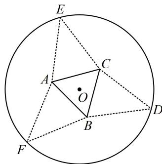

<!-- question-source:start -->
8. (★★★★)

如图，圆形纸片的圆心为 O，半径为 5cm，该纸片上的等边三角形 ABC 的中心为 O, D, E, F 为圆 O 上的点， $\triangle DBC$ ， $\triangle ECA$ ， $\triangle FAB$ 分别是以 BC, CA, AB 为底边的等腰三角形。沿虚线剪开后，分别以 BC, CA, AB 为折痕折起 $\triangle DBC$ ， $\triangle ECA$ ， $\triangle FAB$ ，使得 D, E, F 重合，得到三棱锥。当 $\triangle ABC$ 的边长变化时，所得三棱锥体积（单位： $cm^{3}$ ）的最大值为 \_\_\_\_。

类型 II：内切球问题
<!-- question-source:end -->

![[Q00050879A1]]
