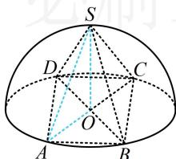

> [!faq]- 《第2节 规则几何体的结构计算》参考答案
>
> > [!success]- **【答案】** C
>
> > [!note]- **【分析】**
> > 本题未单列分析。
>
> > [!note]- **【解析】**
> > C
> >
> > 解析：涉及正四棱锥，先作高，由于要算球的半径，故分析包含高 $SO$ 和半径 $OA$ 的截面 $SOA$ 如图，设球的半径为 $R$ ，则 $SO = OA = R$ ， $AB = \sqrt{2} R$ 正四棱锥的体积 $V = \frac{1}{3}\times (\sqrt{2} R)^2\times R = \frac{4\sqrt{2}}{3}$ 所以 $R = \sqrt{2}$ ，故半球的体积为 $\frac{1}{2}\times \frac{4}{3}\pi R^3 = \frac{4\sqrt{2}}{3}\pi .$
> >
> > 
> >
> > 侧棱长为2的正三棱锥，若其底面周长为9，则该正三棱锥的体积是（）
> > A. $\frac{9\sqrt{3}}{2}$ B. $\frac{3\sqrt{3}}{4}$ C. $\frac{3\sqrt{3}}{2}$ D. $\frac{9\sqrt{3}}{4}$
