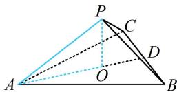

> [!faq]- 《第2节 规则几何体的结构计算》参考答案
>
> > [!success]- **【答案】** B
>
> > [!note]- **【分析】**
> > 本题未单列分析。
>
> > [!note]- **【解析】**
> > B
> > 解析：如图，不妨设 PA = PB = PC = 2， $\triangle ABC$ 是正三角形，由题意，其周长为 9，所以 AB = BC = AC = 3，因为已知侧棱，所以研究高和侧棱构成的截面，
> > 作 PO⊥平面 ABC 于点 O，则 O 是 $\triangle ABC$ 的中心，
> > 连接 AO 并延长，交 BC 于点 D，则 D 为 BC 中点，
> > 所以 $AO=\frac{2}{3}AD=\frac{2}{3}\times\frac{\sqrt{3}}{2}\times3=\sqrt{3}$ ， $OP=\sqrt{PA^{2}-AO^{2}}=1$ 所以 $V_{P-ABC}=\frac{1}{3}S_{\triangle ABC}\cdot OP=\frac{1}{3}\times\frac{1}{2}\times3\times3\times\frac{\sqrt{3}}{2}\times1=\frac{3\sqrt{3}}{4}$
> >
> > 
