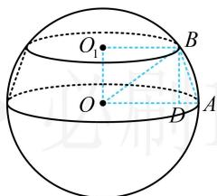

> [!faq]- 《第2节 规则几何体的结构计算》参考答案
>
> > [!success]- **【答案】** C
>
> > [!note]- **【分析】**
> > 本题未单列分析。
>
> > [!note]- **【解析】**
> > ## 3. (2023·重庆模拟·★★★)
> >
> > 圆台上、下底面圆的圆周都在一个半径为5的球面上，其上、下底面圆的周长分别为 $8\pi$ 和 $10\pi$ ，则该圆台的侧面积为（ ）A. $8\sqrt{10}\pi$ B. $8\sqrt{11}\pi$ C. $9\sqrt{10}\pi$ D. $9\sqrt{11}\pi$
> >
> > 解析：如图，圆台和球都是旋转体，到任意的过轴的截面分析均可，不妨选取图中的截面 $OO_{1}BA$ 来算需要的量，
> > 由题意， $\left\{\begin{aligned}&2\pi\cdot O_{1}B=8\pi\\ &2\pi\cdot OA=10\pi\end{aligned}\right.$ ，所以 $\left\{\begin{aligned}O_{1}B&=4\\ O A&=5\end{aligned}\right.$ 上下底半径有了，求圆台侧面积还差母线长AB，
> > 作 BD⊥OA 于 D，则 OD = O₁B = 4，AD = OA - OD = 1，
> > OB = 5， $OO_{1}=\sqrt{OB^{2}-O_{1}B^{2}}=3$ 所以 BD = 3，母线长 $AB = \sqrt{BD^{2} + AD^{2}} = \sqrt{10}$ 故圆台的侧面积 $S = \pi(r_{1} + r_{2})l = \pi \times (4 + 5) \times \sqrt{10} = 9\sqrt{10}\pi$
> >
> > 
