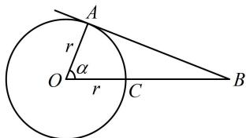

> [!faq]- 《第2节 规则几何体的结构计算》参考答案
>
> > [!success]- **【答案】** C
>
> > [!note]- **【分析】**
> > 本题未单列分析。
>
> > [!note]- **【解析】**
> > C
> > 解析：读完题发现要求的百分比是 $\frac{2\pi r^{2}(1-\cos\alpha)}{4\pi r^{2}}=\frac{1-\cos\alpha}{2}$ ，所以只需求 $\alpha$ ，可画剖面图来看，
> >
> > 如图，同步卫星位于点 $B$ 处，点 $A$ 是地球上能观测到该同步卫星的纬度最大的点，其中 $AB$ 与圆 $O$ 相切，则 $\angle AOB = \alpha$ 且 $OA \perp AB$ ，设线段 $OB$ 与球 $O$ 表面交于点 $C$ ，则 $OC = r = 6400$ ， $BC = 36000$ ，所以 $\cos \alpha = \frac{OA}{OB} = \frac{6400}{6400 + 36000} \approx 0.151$ ，从而 $\frac{1 - \cos \alpha}{2} \approx \frac{1 - 0.151}{2} = 0.4245 \approx 0.42$
> >
> > 故 S 占地球表面积的百分比为 42%.
> >
> > 
