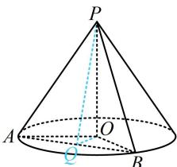

> [!faq]- 《第2节 规则几何体的结构计算》参考答案
>
> > [!success]- **【答案】** A
>
> > [!note]- **【分析】**
> > 本题未单列分析。
>
> > [!note]- **【解析】**
> > (2023·全国乙卷·★★★)
> >
> > 已知圆锥 $PO$ 的底面半径为 $\sqrt{3}$ ， $O$ 为底面圆心， $PA$ ， $PB$ 为圆锥的母线， $\angle AOB = 120^{\circ}$ ，若 $\triangle PAB$ 的面积等于 $\frac{9\sqrt{3}}{4}$ ，则该圆锥的体积为（）  
> > A. $\pi$ B. $\sqrt{6}\pi$ C. $3\pi$ D. $3\sqrt{6}\pi$
> >
> > 解析：条件给出 $S_{\triangle PAB}$ ，先看用它能求出什么。由于不知道角，所以用“ $\frac{1}{2} \times$ 底 $\times$ 高”算 $S_{\triangle PAB}$ ，注意到 $AB$ 可在 $\triangle AOB$ 中求得，故若以 $AB$ 为底，则结合 $S_{\triangle PAB}$ 已知，可求出高 $PQ$ ，接下来方向就明确了，只需研究高 $PQ$ 所在的截面，在 $\triangle AOB$ 中，由余弦定理， $AB^2 = OA^2 + OB^2 - 2OA \cdot OB \cdot \cos \angle AOB = 9$ ，所以 $AB = 3$ ，取 $AB$ 中点 $Q$ ，连接 $PQ, OQ$ ，则 $OQ \perp AB, PQ \perp AB$ ，所以 $S_{\triangle PAB} = \frac{1}{2} AB \cdot PQ = \frac{1}{2} \times 3 \times PQ = \frac{3}{2} PQ$ ，又 $S_{\triangle PAB} = \frac{9\sqrt{3}}{4}$ ，所以 $\frac{3}{2} PQ = \frac{9\sqrt{3}}{4}$ ，故 $PQ = \frac{3\sqrt{3}}{2}$ ，在 $\triangle AOQ$ 中， $\angle AOQ = \frac{1}{2} \angle AOB = 60^\circ$ ，所以 $OQ = OA \cdot \cos \angle AOQ = \frac{\sqrt{3}}{2}$ ，故 $OP = \sqrt{PQ^2 - OQ^2} = \sqrt{6}$ ，所以圆锥 $PO$ 的体积 $V = \frac{1}{3}\pi \times (\sqrt{3})^2 \times \sqrt{6} = \sqrt{6}\pi$ 。
> >
> > 
