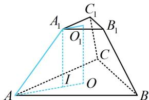

> [!faq]- 《第2节 规则几何体的结构计算》参考答案
>
> > [!success]- **【答案】** B
>
> > [!note]- **【分析】**
> > 本题未单列分析。
>
> > [!note]- **【解析】**
> > (2024·新课标Ⅱ卷·★★★)
> >
> > 已知正三棱台 $ABC - A_{1}B_{1}C_{1}$ 的体积为 $\frac{52}{3}$ ， $AB = 6$ ， $A_{1}B_{1} = 2$ ，则 $A_{1}A$ 与平面 $ABC$ 所成角的正切值为（）  
> > A. $\frac{1}{2}$ B. 1  
> > C. 2 D. 3
> >
> > 解析：已知体积和上下底边长，可建立方程求出正三棱台的高，设正三棱台的高为 $h$ ，由题意，上底面积 $S^{\prime} = \frac{1}{2}\times 2\times 2\times \sin \frac{\pi}{3} = \sqrt{3}$ ，下底面积 $S = \frac{1}{2}\times 6\times 6\times \sin \frac{\pi}{3} = 9\sqrt{3}$ 所以正三棱台的体积 $V = \frac{1}{3} (S + S' + \sqrt{SS'})h$
> >
> > $= \frac{1}{3}\times (\sqrt{3} +9\sqrt{3} +\sqrt{\sqrt{3}\times 9\sqrt{3}})h = \frac{13\sqrt{3}}{3} h$ ，又由题意，三棱台的体积为 $\frac{52}{3}$ ，所以 $\frac{13\sqrt{3}}{3} h = \frac{52}{3}$ ，故 $h = \frac{4\sqrt{3}}{3}$
> >
> > 正三棱台是规则几何体，常到包含高的截面中分析问题，结合所求可知应选取包含高和 $A_{1}A$ 的截面来分析，如图， $O_{1}$ ， $O$ 分别是上、下底面中心，作 $A_{1}I \perp OA$ 于点 $I$ ，则 $A_{1}I \perp$ 平面 $ABC$ ， $A_{1}I = OO_{1} = h = \frac{4\sqrt{3}}{3}$ ，又因为 $OA = \frac{2}{3} \times 6 \times \frac{\sqrt{3}}{2} = 2\sqrt{3}$ ， $O_{1}A_{1} = \frac{2}{3} \times 2 \times \frac{\sqrt{3}}{2} = \frac{2\sqrt{3}}{3}$ ，所以 $IA = OA - OI = OA - O_{1}A_{1} = \frac{4\sqrt{3}}{3}$ ，从而 $\tan \angle A_{1}IA = \frac{A_{1}I}{IA} = 1$ ，故直线 $A_{1}A$ 与平面 $ABC$ 所成角的正切值为 1.
> >
> > 
