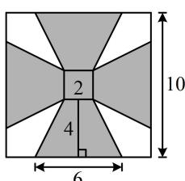
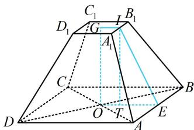

> [!faq]- 《第2节 规则几何体的结构计算》参考答案
>
> > [!success]- **【答案】** B
>
> > [!note]- **【分析】**
> > 本题未单列分析。
>
> > [!note]- **【解析】**
> > B
> >
> > 解析：可以想象拼接后的容器是正四棱台，上、下底面边长分别为2和6，斜高为4，如图1，正四棱台如图2，要求体积，还需算高OG.已知斜高，故在截面OGIE中分析，其中 $I$ ， $G$ 分别为所在棱中点，作 $IT\perp OE$ 于 $T$ ，则 $OT = IG = 1$ ， $TE = OE - OT = 3 - 1 = 2$ ， $IE = 4$ ，在 $\triangle ITE$ 中， $IT = \sqrt{IE^2 - TE^2} = 2\sqrt{3}$ ，所以 $OG = IT = 2\sqrt{3}$ ，故正四棱台的体积 $V = \frac{1}{3}\times (2\times 2 + 6\times 6 + \sqrt{2\times 2\times 6\times 6})\times 2\sqrt{3} = \frac{104\sqrt{3}}{3}.$
> >
> >   
> > 图1
> >
> >   
> > 图2
