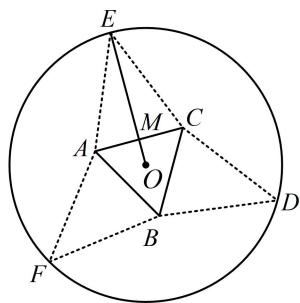
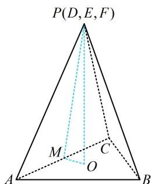

> [!faq]- 《第2节 规则几何体的结构计算》参考答案
>
> > [!success]- **【答案】** $4 \sqrt{15}$
>
> > [!note]- **【分析】**
> > 本题未单列分析。
>
> > [!note]- **【解析】**
> > 解析：折起后的图形是正三棱锥，注意到图2中的 $PM + OM$ 等于图1中的 $OE$ ，为定值，故到截面POM中分析，不妨设 $OM$ 为变量，则 $OP$ 也能用 $OM$ 表示，从而把 $V_{P - ABC}$ 表示成关于 $OM$ 的单变量函数，
> >
> > 在图1中，设 $OM = x$ ，则 $EM = 5 - x$
> >
> > 因为 $AB \times \frac{\sqrt{3}}{2} \times \frac{1}{3} = OM$ ，所以 $AB = 2\sqrt{3} x$
> >
> > 故在图2中， $PM = 5 - x$ ， $OM = x$
> >
> > 由 $PM > OM$ 可得 $5 - x > x$ ，所以 $0 < x < \frac{5}{2}$
> >
> > 因为 $PO \perp$ 平面 $ABC$ ，所以 $PO \perp OM$ ，
> >
> > 从而 $PO = \sqrt{PM^2 - OM^2} = \sqrt{(5 - x)^2 - x^2} = \sqrt{25 - 10x}$
> >
> > 故 $V_{P - ABC} = \frac{1}{3} S_{\triangle ABC}\cdot PO$
> >
> > $$
> > = \frac {1}{3} \times \frac {1}{2} \times (2 \sqrt {3} x) ^ {2} \times \frac {\sqrt {3}}{2} \times \sqrt {2 5 - 1 0 x} = \sqrt {(7 5 - 3 0 x) x ^ {4}},
> > $$
> >
> > 要求 $V_{P - ABC}$ 的最大值，可将根号内的部分单独拿出来，构造函数求导分析，设 $f(x) = (75 - 30x)x^4\left(0 < x < \frac{5}{2}\right)$ ，
> >
> > 则 $f^{\prime}(x) = -30x^{4} + (75 - 30x)\cdot 4x^{3} = 150x^{3}(2 - x)$
> >
> > 所以 $f'(x)>0\Leftrightarrow0<x<2,\quad f'(x)<0\Leftrightarrow2<x<\frac{5}{2}$
> >
> > 从而 $f(x)$ 在 $(0,2)$ 上 $\nearrow$ ，在 $\left(2,\frac{5}{2}\right)$ 上 $\searrow$
> >
> > 故 $f(x)_{\mathrm{max}} = f(2) = 240$ ，所以 $(V_{P - ABC})_{\mathrm{max}} = 4\sqrt{15}$
> >
> >   
> > 图1
> >
> >   
> > 图2
> >
> > 类型Ⅱ：内切球问题
