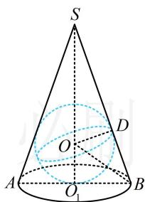

> [!faq]- 《第2节 规则几何体的结构计算》参考答案
>
> > [!success]- **【答案】** $8\pi$
>
> > [!note]- **【分析】**
> > 本题未单列分析。
>
> > [!note]- **【解析】**
> > 解析：已有圆锥的底面半径，求表面积还差母线长。条件给出了圆锥的内切球半径，圆锥和球都是旋转体，故任选一个过轴的截面来分析几何关系，都能求圆锥的母线长，不妨选取图中的截面 SAB 来分析，
> >
> > 如图，由题意， $O_{1}B=\sqrt{2}$ ， $OD=OO_{1}=1$ ，
> >
> > 所以 $\tan \angle OBO_{1} = \frac{OO_{1}}{O_{1}B} = \frac{\sqrt{2}}{2}$ ，故 $\tan \angle SBO_{1} = \tan 2\angle OBO_{1}$
> >
> > $$
> > = \frac {2 \tan \angle O B O _ {1}}{1 - \tan^ {2} \angle O B O _ {1}} = \frac {2 \times \frac {\sqrt {2}}{2}}{1 - \left(\frac {\sqrt {2}}{2}\right) ^ {2}} = 2 \sqrt {2},
> > $$
> >
> > 又 $\tan \angle SBO_{1} = \frac{SO_{1}}{O_{1}B}$ ，所以 $\frac{SO_1}{O_1B} = 2\sqrt{2}$
> >
> > 故 $SO_{1} = 2\sqrt{2} O_{1}B = 4$ ， $SB = \sqrt{SO_1^2 + O_1B^2} = 3\sqrt{2}$
> >
> > 所以圆锥的表面积为 $S = \pi \times (\sqrt{2})^2 +\pi \times \sqrt{2}\times 3\sqrt{2} = 8\pi .$
> >
> > 
