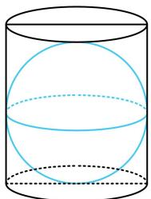
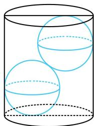
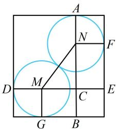

> [!faq]- 《第2节 规则几何体的结构计算》参考答案
>
> > [!success]- **【答案】** $\frac{5}{2}$
>
> > [!note]- **【分析】**
> > 本题未单列分析。
>
> > [!note]- **【解析】**
> > 解析：如图1，可以想象，若球的半径等于圆柱的底面半径，则只能放下一个球，所以要放下两个半径相等的球，应如图2，如何计算此时球的半径？不妨画出剖面图来分析，如图3，设两个球的半径为 $R(R < 4)$ ，
> >
> > 怎样建立方程求 $R$ ？观察发现两个球是外切的，于是 $MN = 2R$ ，故只要再把 $MC$ 和 $CN$ 用 $R$ 表示，就能在 $\triangle CMN$ 中用勾股定理建立方程求 $R$ ，于是按此尝试，
> >
> > 由图3可知， $MN = 2R$ ， $MC = DE - DM - CE$
> >
> > $$
> > = D E - D M - N F = 8 - 2 R
> > $$
> >
> > $NC = AB - AN - BC = AB - AN - MG = 9 - 2R$
> >
> > 在 $\triangle CMN$ 中， $MC^2 +NC^2 = MN^2$
> >
> > 所以 $(8 - 2R)^{2} + (9 - 2R)^{2} = 4R^{2}$
> >
> > 解得： $R = \frac{5}{2}$ 或 $\frac{29}{2}$ （舍去）.
> >
> >   
> > 图1
> >
> >   
> > 图2
> >
> >   
> > 图3
