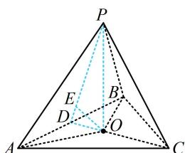

> [!faq]- 《第2节 规则几何体的结构计算》参考答案
>
> > [!success]- **【答案】** A
>
> > [!note]- **【分析】**
> > 本题未单列分析。
>
> > [!note]- **【解析】**
> > 已知正四面体 $P - ABC$ 的棱长为 1，点 $O$ 为底面 $ABC$ 的中心，球 $O$ 与该正四面体的其余三个面都有且只有一个公共点，且公共点非该正四面体的顶点，则球 $O$ 的半径为（）
> > A. $\frac{\sqrt{6}}{12}$ B. $\frac{\sqrt{6}}{9}$ C. $\frac{\sqrt{2}}{9}$ D. $\frac{\sqrt{2}}{3}$
> >
> > 解法1：由题意，面 $PAB$ ， $PAC$ ， $PBC$ 都与球 $O$ 相切，所以球 $O$ 的半径即为点 $O$ 到面 $PAB$ 的距离，怎样求此距离？正四面体是规则几何体，结合对称性可以想象切点 $E$ 应在中线 $PD$ 上，故分析过高 $PO$ 和中线 $PD$ 的截面，如图，设 $D$ 为 $AB$ 中点，则 $AB \perp PD$ ， $AB \perp CD$ ，所以 $AB \perp$ 平面 $PCD$ ，作 $OE \perp PD$ 于 $E$ ，则 $OE \subset$ 平面 $PCD$ ，所以 $OE \perp AB$ ，故 $OE \perp$ 平面 $PAB$ ，怎样计算 $OE$ ？我们发现它是 Rt△POD 斜边上的高，故可用等面积法计算，因为 $O$ 是△ABC 的中心，所以它也是重心，故 $OD = \frac{1}{3} CD = \frac{1}{3} \times \frac{\sqrt{3}}{2} \times 1 = \frac{\sqrt{3}}{6}$ ，又 $PD = \frac{\sqrt{3}}{2}$ ，所以 $PO = \sqrt{PD^2 - OD^2} = \frac{\sqrt{6}}{3}$ ，因为 $S_{\triangle POD} = \frac{1}{2} PO \cdot OD = \frac{1}{2} PD \cdot OE$ ，所以 $OE = \frac{PO \cdot OD}{PD}$ $= \frac{\frac{\sqrt{6}}{3} \times \frac{\sqrt{3}}{6}}{\frac{\sqrt{3}}{2}} = \frac{\sqrt{6}}{9}$ ，故球 $O$ 的半径为 $\frac{\sqrt{6}}{9}$ .
> >
> > 
> >
> > 解法2：注意到 $O$ 到正四面体的三个侧面等距，而距离可以与体积联系起来，故可考虑用等体积法建立方程求该距离.上述思路也是求解棱锥内切球问题的一个通用思路，设球 $O$ 的半径为 $r$ ，如图， $V_{P - ABC} = V_{O - PAB} + V_{O - PBC}+$ $V_{O - PAC} = \frac{1}{3} S_{\triangle PAB}\cdot r + \frac{1}{3} S_{\triangle PBC}\cdot r + \frac{1}{3} S_{\triangle PAC}\cdot r$ $= \frac{r}{3} (S_{\triangle PAB} + S_{\triangle PBC} + S_{\triangle PAC})$ ①，又由题意，正四面体 $P - ABC$ 每个面的面积都为 $\frac{1}{2}\times 1\times 1\times \sin \frac{\pi}{3} = \frac{\sqrt{3}}{4},$
> >
> > 结合①得 $V_{P - ABC} = \frac{r}{3}\times \left(\frac{\sqrt{3}}{4} +\frac{\sqrt{3}}{4} +\frac{\sqrt{3}}{4}\right) = \frac{\sqrt{3}r}{4}$ ②，
> >
> > 另一方面， $O$ 为 $\triangle ABC$ 的中心，也是重心，所以 $OC =$
> >
> > $$
> > \frac {2}{3} C D = \frac {2}{3} \times \frac {\sqrt {3}}{2} \times 1 = \frac {\sqrt {3}}{3}, O P = \sqrt {P C ^ {2} - O C ^ {2}} = \frac {\sqrt {6}}{3},
> > $$
> >
> > $$
> > V _ {P - A B C} = \frac {1}{3} S _ {\triangle A B C} \cdot O P = \frac {1}{3} \times \frac {\sqrt {3}}{4} \times \frac {\sqrt {6}}{3} = \frac {\sqrt {2}}{1 2}
> > $$
> >
> > 与②对比可得 $\frac{\sqrt{3}r}{4} = \frac{\sqrt{2}}{12}$ ，解得： $r = \frac{\sqrt{6}}{9}$ .
>
> > [!tip]- **【反思】**
> > 与三角形内切圆半径的等面积法计算原理类似，三棱锥的内切球半径也可用等体积法来计算.
