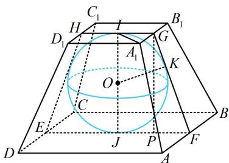

> [!faq]- 《第2节 规则几何体的结构计算》参考答案
>
> > [!success]- **【答案】** $\frac{28}{3}$
>
> > [!note]- **【分析】**
> > 本题未单列分析。
>
> > [!note]- **【解析】**
> > 解析：如图，由正四棱台的对称性，其内切球 $O$ 与上、下底面的切点为上、下底面的中心，与侧面的切点应在侧面等腰梯形上下底边中点的连线上，因为球 $O$ 的半径 $R = 1$ ，所以正四棱台的高 $h = IJ = 2R = 2$ 求正四棱台的体积还差上、下底面边长，由于是内切球，切点非常关键，又已知高，故考虑到包含高和切点的截面（如图中的截面EFGH）中来分析几何关系，求上、下底面边长，设正四棱台的上底面边长为 $a$ 由题意，下底面边长为 $2a$ ，所以 $IG = \frac{a}{2}$ ， $JF = a$ 作 $GP\bot JF$ 于点 $P$ ，则 $GP = IJ = 2$ ， $JP = IG = \frac{a}{2}$ ， $PF = JF - JP = a - \frac{a}{2} = \frac{a}{2}$ 由切线长相等， $GK = IG = \frac{a}{2}$ ， $FK = JF = a$ 所以 $GF = GK + FK = \frac{a}{2} + a = \frac{3a}{2}$ 在 $\triangle GPF$ 中， $GP^2 +PF^2 = GF^2$ 所以 $2^{2} + \left(\frac{a}{2}\right)^{2} = \left(\frac{3a}{2}\right)^{2}$ ，解得： $a = \sqrt{2}$ 所以正四棱台的上底面积 $S = a^2 = 2$ ，下底面积 $S' = (2a)^2 = 8$ ，故其体积 $V = \frac{1}{3}(S + S' + \sqrt{SS'})h$ $= \frac{1}{3}\times (2 + 8 + \sqrt{2\times 8})\times 2 = \frac{28}{3}$
> >
> > 
