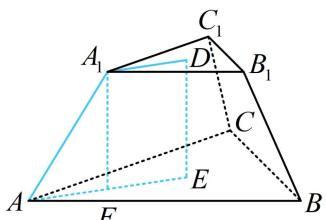
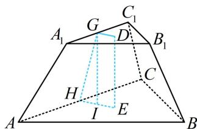

<!-- source-part:1 pages:1-10 -->

# 第 2 节 规则几何体的结构计算（★★★）

## 内容提要

本节归纳涉及球、正棱锥、正棱台、圆锥、圆台等规则几何体结构的空间计算问题，先解释几个名词.

1. 正棱锥: 底面为正多边形, 顶点在底面的投影为正多边形的中心的棱锥.

2. 正四面体: 侧棱和底面边长相等的正三棱锥, 它的所有棱长都相等, 四个面都是正三角形.

3. 正棱台：正棱锥被平行于底面的平面所截，截面与底面之间的部分叫做正棱台.

4. 圆台：圆锥被平行于底面的平面所截，截面与底面之间的部分叫做圆台.

涉及上述几何体的空间计算, 核心往往都是抓住某个截面, 把空间计算问题向平面转化, 尤其是经过高的截面. 例如, 在正三棱台中, 如图 1 的截面 $A_{1}DEA$ 可沟通高、侧棱长、上下底面边长, 如图 2 的截面 $DGHE$ 可沟通高、斜高 (GH)、上下底面边长.

  
图1

  
图2

对于其它规则几何体，处理方法也类似，按照题目条件，选取适当的截面研究即可.

5. 对于内切球问题，也是选取适当的截面研究，一般会选取切点和轴（或高）所在的截面来分析.

![[高中/总复习/教辅/一数常规版2026/第9章 立体几何、空间向量/模块1 立体图形的结构探究/第2节 规则几何体的结构计算/类型01_球的截面研究/类型01_球的截面研究.md]]
![[高中/总复习/教辅/一数常规版2026/第9章 立体几何、空间向量/模块1 立体图形的结构探究/第2节 规则几何体的结构计算/类型02_锥体的_定海神针_一高/类型02_锥体的_定海神针_一高.md]]
![[高中/总复习/教辅/一数常规版2026/第9章 立体几何、空间向量/模块1 立体图形的结构探究/第2节 规则几何体的结构计算/类型03_台体的截面研究/类型03_台体的截面研究.md]]
![[高中/总复习/教辅/一数常规版2026/第9章 立体几何、空间向量/模块1 立体图形的结构探究/第2节 规则几何体的结构计算/类型04_情境题探究/类型04_情境题探究.md]]
![[高中/总复习/教辅/一数常规版2026/第9章 立体几何、空间向量/模块1 立体图形的结构探究/第2节 规则几何体的结构计算/类型05_内切球问题/类型05_内切球问题.md]]
![[高中/总复习/教辅/一数常规版2026/第9章 立体几何、空间向量/模块1 立体图形的结构探究/第2节 规则几何体的结构计算/强化训练/强化训练.md]]
