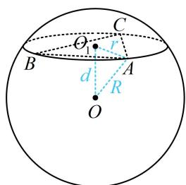
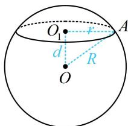

> [!faq]- 《第2节 规则几何体的结构计算》例题解析
>
> > [!success]- **【答案】** C
>
> > [!note]- **【分析】**
> > 本题未单列分析。
>
> > [!note]- **【解析】**
> > 解析：球心到截面的距离即为球心和截面圆圆心之间的线段长，故连接球心 $O$ 和 $\triangle ABC$ 的外心 $O_{1}$
> >
> > 如图， $\triangle ABC$ 是面积为 $\frac{9\sqrt{3}}{4}$ 的等边三角形，设边长为 $x$ ，则 $\frac{1}{2} x^2 \sin 60^\circ = \frac{\sqrt{3}}{4} x^2 = \frac{9\sqrt{3}}{4} \Rightarrow x = 3$ ，
> >
> > 由正弦定理， $\frac{3}{\sin 60^{\circ}} = 2r\Rightarrow r = \sqrt{3}$
> >
> > 由球的性质， $OO_{1}\perp$ 平面ABC，所以 $OO_{1}\perp O_{1}A$ ，
> >
> > 球 O 的表面积 $S = 4\pi R^{2} = 16\pi \Rightarrow R = 2$ ,
> >
> > 故 $O$ 到平面 $ABC$ 的距离 $d = \sqrt{OA^2 - O_1A^2} = \sqrt{R^2 - r^2} = 1$ .
> >
> >
> > 
>
> > [!tip]- **【反思】**
> > 有关球的计算问题，常连接球心和截面圆圆心（该连线必垂直于截面圆所在的平面），在如图所示直角 $\triangle OO_{1}A$ 中用勾股定理 $r^{2} + d^{2} = R^{2}$ 沟通 $r, d, R$ .
> >
> > 
