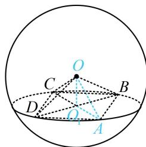

> [!faq]- 《第2节 规则几何体的结构计算》例题解析
>
> > [!success]- **【答案】** C
>
> > [!note]- **【分析】**
> > 本题未单列分析。
>
> > [!note]- **【解析】**
> > 不妨设 $OO_{1} = d$ ，则 $O_{1}A = \sqrt{OA^{2} - OO_{1}^{2}} = \sqrt{1 - d^{2}}$ ，所以 $AB = \sqrt{2} O_1A = \sqrt{2(1 - d^2)}$
> >
> > 故 $V_{O - ABCD} = \frac{1}{3}\times 2(1 - d^2)\cdot d = \frac{2}{3} (d - d^3)$ ，设 $f(d) = \frac{2}{3} (d - d^3)(0 <   d <   1)$ ，则 $f^{\prime}(d) = \frac{2}{3} (1 - 3d^{2})$
> >
> > $$
> > f ^ {\prime} (d) > 0 \Leftrightarrow 0 <   d <   \frac {\sqrt {3}}{3}
> > $$
> >
> > $$
> > f ^ {\prime} (d) <   0 \Leftrightarrow \frac {\sqrt {3}}{3} <   d <   1
> > $$
> >
> > 从而 $f(d)$ 在 $\left(0, \frac{\sqrt{3}}{3}\right)$ 上 $\nearrow$ ，在 $\left(\frac{\sqrt{3}}{3}, 1\right)$ 上 $\searrow$ ，故 $f(d)_{\max} = f\left(\frac{\sqrt{3}}{3}\right)$ ，
> >
> > 所以当该四棱锥的体积最大时，其高为 $\frac{\sqrt{3}}{3}$
> >
> > 
