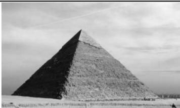

<!-- question-source:start -->
【变式1】(2020·新课标Ⅰ卷) 埃及胡夫金字塔是古代世界建筑奇迹之一, 它的形状可视为一个正四棱锥, 以该四棱锥的高为边长的正方形面积等于该四棱锥一个侧面三角形的面积, 则其侧面三角形底边上的高与底面正方形的边长的比值为 ( )

A. $\frac{\sqrt{5}-1}{4}$ B. $\frac{\sqrt{5}-1}{2}$ C. $\frac{\sqrt{5}+1}{4}$ D. $\frac{\sqrt{5}+1}{2}$

<!-- question-source:end -->

![[高中/总复习/教辅/一数常规版2026/第9章 立体几何、空间向量/模块1 立体图形的结构探究/第2节 规则几何体的结构计算/类型02_锥体的_定海神针_一高/例题/answers/Q00050514A1.md]]
