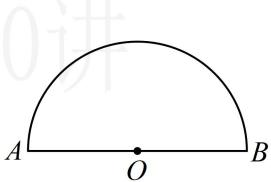
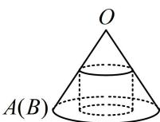

<!-- question-source:start -->
【变式2】如图，将半径为4的半圆围成一个圆锥，在圆锥内接一个圆柱，当圆柱的侧面面积最大时，圆柱的底面半径是（）
A. $\frac{4\sqrt{5}}{5}$ B. $4\sqrt{3}-6$ C. 1 D. $2\sqrt{3}\pi$

$$
2 \pi \cdot G D = 4 \pi
$$

$$
O A = O D = 4
$$

$$
O G = \sqrt {O D ^ {2} - G D ^ {2}} = 2 \sqrt {3}
$$

设圆柱的底面半径为 $r$ ，即 $CE = r$ ，由 $\triangle OEC\sim \triangle OGD$ 可得 $\frac{CE}{GD} = \frac{OE}{OG}$
<!-- question-source:end -->

![[高中/总复习/教辅/一数常规版2026/第9章 立体几何、空间向量/模块1 立体图形的结构探究/第2节 规则几何体的结构计算/类型02_锥体的_定海神针_一高/例题/answers/Q00050515A1.md]]
