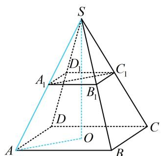
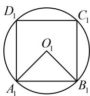

> [!faq]- 《第2节 规则几何体的结构计算》例题解析
>
> > [!success]- **【答案】** 详见解析
>
> > [!note]- **【分析】**
> > 本题未单列分析。
>
> > [!note]- **【解析】**
> > 解析：由条件可知四棱锥为正四棱锥，故先作高. 已知侧棱长，所以分析侧棱与高构成的截面 $SAO$
> >
> > 如图1，由题意， $AB = \sqrt{2}$ ， $SA = \sqrt{5}$ ，所以 $OA = \frac{\sqrt{2}}{2} AB = 1$ ， $SO = \sqrt{SA^2 - OA^2} = 2$ ，故圆柱的高 $h = 1$ 圆柱的一个底面圆为正方形 $A_{1}B_{1}C_{1}D_{1}$ 的外接圆，如图2，因为 $A_{1}B_{1} = \frac{1}{2} AB = \frac{\sqrt{2}}{2}$ ，所以圆柱的底面半径 $r = O_{1}A_{1} = \frac{\sqrt{2}}{2} A_{1}B_{1} = \frac{1}{2}$ ，故圆柱的体积 $V = \pi r^2 h = \frac{\pi}{4}$ 答案： $\frac{\pi}{4}$
> >
> >   
> > 图1
> >
> >   
> > 图2
