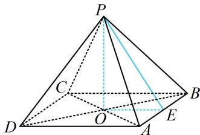

> [!faq]- 《第2节 规则几何体的结构计算》例题解析
>
> > [!success]- **【答案】** C
>
> > [!note]- **【分析】**
> > 本题未单列分析。
>
> > [!note]- **【解析】**
> > 解析：涉及正四棱锥，先作高。由于要求的是斜高（侧面三角形底边上的高）与底面边长的比值，故设出这两个量，通过分析过高和斜高的截面 $POE$ 来研究它们的关系，如图，设正四棱锥 $P - ABCD$ 底面边长为 $a$ ，斜高 $PE = h$ ，其中 $E$ 为 $AB$ 中点，则 $S_{\triangle PAB} = \frac{1}{2} AB \cdot PE = \frac{1}{2} ah$ ，在 $\triangle POE$ 中， $OE = \frac{1}{2} AD = \frac{a}{2}$ ，所以四棱锥的高 $OP = \sqrt{PE^2 - OE^2} = \sqrt{h^2 - \frac{a^2}}$ ，由题意，以 $OP$ 为边长的正方形面积与 $\triangle PAB$ 的面积相等，所以 $h^2 - \frac{a^2}{4} = \frac{1}{2} ah$ ，整理得： $4h^2 - 2ah - a^2 = 0$ ，所以 $4\left(\frac{h}{a}\right)^2 - 2 \cdot \frac{h}{a} - 1 = 0$ ，解得： $\frac{h}{a} = \frac{1 + \sqrt{5}}{4}$ 或 $\frac{1 - \sqrt{5}}{4}$ （舍去）。
> >
> > 
>
> > [!tip]- **【反思】**
> > 通过上两题可以发现，截面选取的动机非常明确，结合条件与要求的即可判断所需截面.
