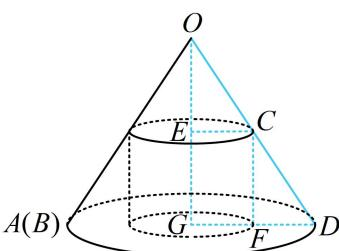

> [!faq]- 《第2节 规则几何体的结构计算》例题解析
>
> > [!success]- **【答案】** C
>
> > [!note]- **【分析】**
> > 本题未单列分析。
>
> > [!note]- **【解析】**
> > A. $\frac{4\sqrt{5}}{5}$ B. $4\sqrt{3}-6$ C. 1 D. $2\sqrt{3}\pi$
> >
> > 
> >
> > 
> >
> > $$
> > 2 \pi \cdot G D = 4 \pi
> > $$
> >
> > $$
> > O A = O D = 4
> > $$
> >
> > $$
> > O G = \sqrt {O D ^ {2} - G D ^ {2}} = 2 \sqrt {3}
> > $$
> >
> > 设圆柱的底面半径为 $r$ ，即 $CE = r$ ，由 $\triangle OEC\sim \triangle OGD$ 可得 $\frac{CE}{GD} = \frac{OE}{OG}$
> >
> > 所以 $\frac{r}{2} = \frac{OE}{2\sqrt{3}}$ ，故 $OE = \sqrt{3} r$ ，所以 $GE = OG - OE = 2\sqrt{3} -\sqrt{3} r$
> >
> > 故圆柱的侧面积 $S = 2\pi r\cdot GE = 2\pi r(2\sqrt{3} -\sqrt{3} r) = 2\sqrt{3}\pi r(2 - r)$ $\leq 2\sqrt{3}\pi \cdot \left(\frac{r + 2 - r}{2}\right)^{2} = 2\sqrt{3}\pi$ ，当且仅当 $r = 2 - r$ ，即 $r = 1$ 时取等号，所以当圆柱的侧面积最大时，其底面半径为1.
> >
> > 
>
> > [!tip]- **【总结】**
> > 不管是正棱锥或圆锥，不管图形是否固定，核心总是根据条件选取适当的截面进行研究.
