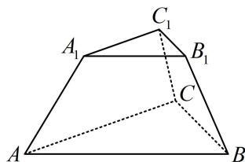

<!-- question-source:start -->
【例 3】如图， $ABC-A_{1}B_{1}C_{1}$ 是一个正三棱台，而且下底面边长为6，上底面边长和侧棱长都为3，则棱台的高为（）
A. $\frac{\sqrt{6}}{3}$ B. $\frac{2\sqrt{3}}{3}$ C. $\sqrt{6}$ D. $\sqrt{3}$

<!-- question-source:end -->

![[高中/总复习/教辅/一数常规版2026/第9章 立体几何、空间向量/模块1 立体图形的结构探究/第2节 规则几何体的结构计算/类型03_台体的截面研究/例题/answers/Q00050516A1.md]]
