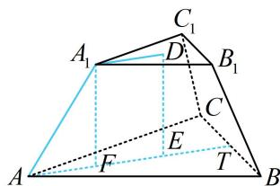

> [!faq]- 《第2节 规则几何体的结构计算》例题解析
>
> > [!success]- **【答案】** C
>
> > [!note]- **【分析】**
> > 本题未单列分析。
>
> > [!note]- **【解析】**
> > A. $\frac{\sqrt{6}}{3}$ B. $\frac{2\sqrt{3}}{3}$ C. $\sqrt{6}$ D. $\sqrt{3}$
> >
> > 
> >
> > 解析：涉及正三棱台，先画图作高，给了侧棱长，故分析高与侧棱构成的截面，如图，D，E分别为上、下底面的中心，也是重心， $A_{1}F \perp AE$ 于F，T是BC中点，则A，E，T共线且 $AE = \frac{2}{3} AT = \frac{2}{3} \times \frac{\sqrt{3}}{2} AB = 2\sqrt{3}$ ，同理， $A_{1}D = \frac{2}{3} \times \frac{\sqrt{3}}{2} A_{1}B_{1} = \sqrt{3}$ ，所以 $EF = A_{1}D = \sqrt{3}$ ， $AF = AE - EF = \sqrt{3}$ ，故 $A_{1}F = \sqrt{AA_{1}^{2} - AF^{2}} = \sqrt{3^{2} - (\sqrt{3})^{2}} = \sqrt{6}$ .
> >
> > 
