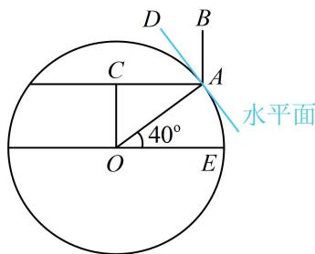

> [!faq]- 《第2节 规则几何体的结构计算》例题解析
>
> > [!success]- **【答案】** B
>
> > [!note]- **【分析】**
> > 本题未单列分析。
>
> > [!note]- **【解析】**
> > 解析：本题信息较复杂，完整的图形不好画，可通过直观想象画剖面图来看，如图，晷针为 $AB$ （晷面与赤道所在平面平行 $\Rightarrow$ 暴针与赤道平面垂直）， $A$ 处的纬度为北纬 $40^{\circ} \Rightarrow \angle AOE = 40^{\circ} \Rightarrow \angle OAC = 40^{\circ}$ $\Rightarrow \angle CAD = 90^{\circ} - \angle OAC = 50^{\circ} \Rightarrow \angle BAD = 90^{\circ} - \angle CAD = 40^{\circ}$ ，即晷针与点 $A$ 处的水平面所成角为 $40^{\circ}$ .
> >
> > 
>
> > [!tip]- **【反思】**
> > 情境题并无通法，但涉及图形长度、角度的计算，时常会选取合适的截面研究.
