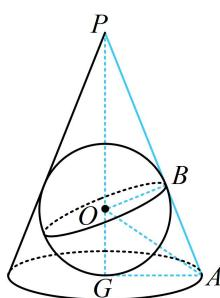

> [!faq]- 《第2节 规则几何体的结构计算》例题解析
>
> > [!success]- **【答案】** $\frac{\sqrt{2}\pi}{3}$
>
> > [!note]- **【分析】**
> > 本题未单列分析。
>
> > [!note]- **【解析】**
> > 解析：显然球最大时，球内切于圆锥。对于内切球问题，抓住切点与轴构成的截面来分析，由于二者都是旋转体，分析过轴的任意截面都行，不妨到如图所示的截面 $PGA$ 中考虑，
> >
> > 该圆锥内半径最大的球即圆锥的内切球，设球心为 $O$ ，半径为 $R$ ，则 $OB = OG = R$ 由切线长相等可知， $AB = AG = 1$
> >
> > 由题意， $PG = \sqrt{PA^2 - AG^2} = 2\sqrt{2}$ ，所以 $OP = 2\sqrt{2} - R$ ， $PB = PA - AB = 2$ ，
> >
> > 在 $\triangle POB$ 中，由 $OB^{2} + PB^{2} = OP^{2}$ 可得 $R^2 +4 = (2\sqrt{2} -R)^2$ ，解得： $R = \frac{\sqrt{2}}{2}$
> >
> > 
> >
> > 所以球的体积 $V = \frac{4}{3}\pi R^3 = \frac{\sqrt{2}\pi}{3}$
