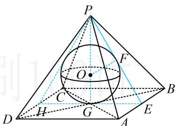
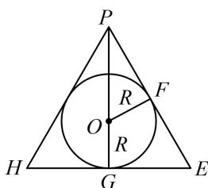

> [!faq]- 《第2节 规则几何体的结构计算》例题解析
>
> > [!success]- **【答案】** $\frac{4\pi}{3}$
>
> > [!note]- **【分析】**
> > 本题未单列分析。
>
> > [!note]- **【解析】**
> > 解析：内切球问题中，切点是关键位置，故应分析切点与正四棱锥的高构成的截面，
> >
> > 如图1，设 $E$ 是 $AB$ 的中点， $H$ 是 $CD$ 中点， $G$ 是底面中心， $F$ 是球面与侧面 $PAB$ 的切点，
> >
> > 由对称性， $F$ 在 $PE$ 上，球心 $O$ 在 $PG$ 上，把截面PHE单独画出来如图2，
> >
> > 因为 $AB = 2$ ， $PA = \sqrt{5}$ ，所以 $PE = \sqrt{PA^2 - AE^2} = 2$ ， $GE = 1$ ， $PG = \sqrt{PE^2 - GE^2} = \sqrt{3}$
> >
> > 要求内切球半径，可到 $\triangle POF$ 中用勾股定理建立方程求解，先求出该三角形的三边长，
> >
> > 设内切球 O 的半径为 R，则 $OP = PG - OG = \sqrt{3} - R$ ，OF = R，
> >
> > 由切线长相等知 $EF = GE = 1$ ，所以 $PF = PE - EF = 1$
> >
> > 在 $\triangle POF$ 中， $PF^{2} + OF^{2} = OP^{2}$
> >
> > 所以 $1^{2} + R^{2} = (\sqrt{3} -R)^{2}$ ，解得： $R = \frac{\sqrt{3}}{3}$
> >
> > 所以该正四棱锥的内切球的表面积 $S=4\pi R^{2}=\frac{4\pi}{3}$ .
> >
> >
> >   
> > 图1
> >
> >   
> > 图2
>
> > [!tip]- **【反思】**
> > 求出 $PE = 2$ 后，若注意到了 $\triangle PHE$ 是正三角形，则也可按 $R = OG = \frac{1}{3} PG = \frac{\sqrt{3}}{3}$ 来速求 $R$ .
