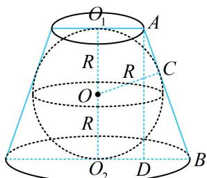

> [!faq]- 《第2节 规则几何体的结构计算》例题解析
>
> > [!success]- **【答案】** $\frac{9}{8}$
>
> > [!note]- **【分析】**
> > 本题未单列分析。
>
> > [!note]- **【解析】**
> > 解析：球与圆台都是旋转体，取过轴的任意一个截面来分析均可，
> >
> > 如图， $AD\bot O_2B$ 于 $D$ ，则 $O_{2}D = O_{1}A = 1$ ， $BD = O_2B - O_2D = 1$
> >
> > 由切线长相等可知， $AC = AO_{1} = 1$ ， $BC = BO_{2} = 2$ ，所以 $AB = AC + BC = 3$
> >
> > 故圆台侧面积 $S_{1} = \pi (r_{1} + r_{2})l = \pi \times (1 + 2)\times 3 = 9\pi$ ，再算球的半径，在 $\triangle ABD$ 中由勾股定理求解即可，
> >
> > 设球的半径为 R，则 $AD = O_{1}O_{2} = 2R$ ，
> >
> > 在 $\triangle ABD$ 中， $AD^{2} + BD^{2} = AB^{2}$ ，即 $4R^{2} + 1 = 9\Rightarrow R = \sqrt{2}$
> >
> > 所以球的表面积 $S_{2} = 4\pi R^{2} = 8\pi$
> >
> > 故该圆台的侧面积与球的表面积之比为 $\frac{S_1}{S_2} = \frac{9}{8}$ .
> >
> >
> > 
>
> > [!tip]- **【总结】**
> > 涉及内切球半径的计算，往往在高（或轴）和切点构成的截面中来分析.
