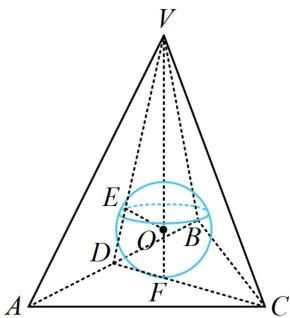
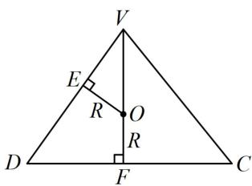
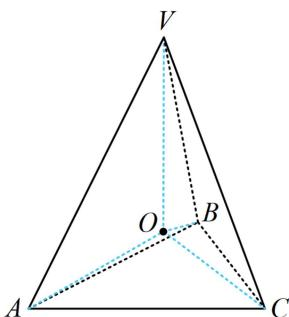

> [!faq]- 《第2节 规则几何体的结构计算》例题解析
>
> > [!success]- **【答案】** $\frac{3\sqrt{2} - \sqrt{6}}{2}$
>
> > [!note]- **【分析】**
> > 本题未单列分析。
>
> > [!note]- **【解析】**
> > 解法 1: 因为是正三棱锥的内切球, 所以关键是分析包含切点和高的截面, 如图 1 中的截面 $VCD$ ,
> >
> > 在图1中，D为AB中点，E为球面与侧面VAB的切点，F是球面与底面的切点，则 $AB\perp VD$ ， $AB\perp CD$ ，所以 $\angle VDC$ 是侧面与底面所成的二面角的平面角，由题意， $\tan\angle VDC=\frac{VF}{DF}=\sqrt{2}$ ①，
> >
> > 因为 AB=6，所以 $DF=\frac{1}{3}CD=\frac{1}{3}\times6\times\frac{\sqrt{3}}{2}=\sqrt{3}$ ，代入①得： $VF=\sqrt{6}$ ，所以 $VD=\sqrt{DF^{2}+VF^{2}}=3$ ，
> >
> > $$
> > O E = O F = R
> > $$
> >
> > $$
> > V O = V F - O F = \sqrt {6} - R
> > $$
> >
> > 由 $\triangle VEO\sim \triangle VFD$ 可得 $\frac{OE}{DF} = \frac{VO}{VD}$ ，即 $\frac{R}{\sqrt{3}} = \frac{\sqrt{6} - R}{3}$ ，解得： $R = \frac{3\sqrt{2} - \sqrt{6}}{2}$
> >
> >   
> > 图1
> >
> >   
> > 图2
> >
> >   
> > 图3
> >
> > 解法 2: 注意到球心 $O$ 到正三棱锥 $V - ABC$ 四个面的距离相等, 都等于内切球的半径, 而该距离可与三棱锥的体积联系起来, 故可考虑用等体积法建立方程求解内切球的半径,
> >
> > 如图3，设正三棱锥 $V - ABC$ 的内切球半径为 $R$ ，则球心 $O$ 到正三棱锥四个面的距离均为 $R$
> >
> > 所以 $V_{V - ABC} = V_{O - VAB} + V_{O - VAC} + V_{O - VBC} + V_{O - ABC} = \frac{1}{3} S_{\triangle VAB}\cdot R + \frac{1}{3} S_{\triangle VAC}\cdot R + \frac{1}{3} S_{\triangle VBC}\cdot R + \frac{1}{3} S_{\triangle ABC}\cdot R$
> >
> > $= \frac{1}{3} (S_{\triangle VAB} + S_{\triangle VAC} + S_{\triangle VBC} + S_{\triangle ABC})R$ ②，
> >
> > 求 $VD, VF$ 的过程同解法 1, 这里不再赘述. 有了 $VD$ 和 $VF$ , 结合正 $\triangle ABC$ 边长已知, 式②中的 $V_{V-ABC}$ 和 $S_{\triangle VAB}$ , $S_{\triangle VAC}$ , $S_{\triangle VBC}$ , $S_{\triangle ABC}$ 都能算, 故而能求出 $R$ ,
> >
> > 由题意， $S_{\triangle ABC} = \frac{1}{2}\times 6^2\times \sin 60^{\circ} = 9\sqrt{3}$ ， $V_{V - ABC} = \frac{1}{3} S_{\triangle ABC}\cdot VF = \frac{1}{3}\times 9\sqrt{3}\times \sqrt{6} = 9\sqrt{2}$
> >
> > 又 $V - ABC$ 为正三棱锥，所以 $S_{\triangle VAB} = S_{\triangle VAC} = S_{\triangle VBC} = \frac{1}{2} AB\cdot VD = \frac{1}{2}\times 6\times 3 = 9$
> >
> > 将上述结果代入式②得 $9\sqrt{2}=\frac{1}{3}\times(9+9+9+9\sqrt{3})R$ ，解得： $R=\frac{3\sqrt{2}-\sqrt{6}}{2}$ .
>
> > [!tip]- **【反思】**
> > 对任意的三棱锥 $V - ABC$ ，设其体积为 $V$ ，表面积为 $S$ ，内切球半径为 $R$ ，都有 $R = \frac{3V}{S}$ ，其推导方法就是本题解法2所用的等体积法，这是一个计算体积和表面积好求的三棱锥的内切球半径的通法。但可发现，此方法的弊端是有时计算量会偏大。
