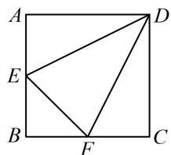
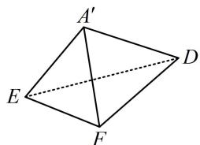

<!-- question-source:start -->
1. (2023·湖南长沙模拟·★★)

如图，边长为2的正方形ABCD中，点E，F分别是边AB，BC的中点，将△AED，△EBF，△FCD分别沿DE，EF，FD折起，使A，B，C三点重合于 $A'$ ，若四面体 $A'EFD$ 的四个顶点在同一个球面上，则该球的半径为\_\_\_\_。

<!-- question-source:end -->

![[Q00050542A1]]
