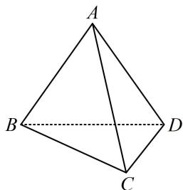

<!-- question-source:start -->
## 8. (2023·贵州贵阳模拟·★★★)

如图，在三棱锥 $A - BCD$ 中，平面 $ABD \perp$ 平面 $BCD$ ， $\triangle BCD$ 是边长为 6 的等边三角形， $AB = AD = 3\sqrt{3}$ ，则该几何体的外接球表面积为 \_\_\_\_.

<!-- question-source:end -->

![[Q00050549A1]]
