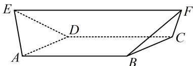

<!-- question-source:start -->
## 10. (2023·山东烟台一模·★★★★)

《九章算术》是我国古代的一部数学名著, 书中记载了一类名为 “羡除” 的五面体. 如图, 在羡除 $ABCDEF$ 中, 底面 $ABCD$ 为矩形, $AB = 2AD = 2$ , $\triangle ADE$ 和 $\triangle BCF$ 均为正三角形, $EF //$ 平面 $ABCD$ , $EF = 3$ , 则该羡除的外接球的表面积为 ( )

A. $\frac{13\pi}{2}$ B. $\frac{15\pi}{2}$ C. $\frac{17\pi}{2}$ D. $\frac{19\pi}{2}$

<!-- question-source:end -->

![[Q00050551A1]]
