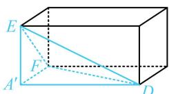

> [!faq]- 《第3节 外接球问题》参考答案
>
> > [!success]- **【答案】** $\frac{\sqrt{6}}{2}$
>
> > [!note]- **【分析】**
> > 本题未单列分析。
>
> > [!note]- **【解析】**
> > 解析：由折叠过程可知折叠后的四面体中， $A^{\prime}E$ ， $A^{\prime}F$ ， $A^{\prime}D$ 两两垂直，外接球属于长方体模型，
> >
> > 如图，由题意， $A^{\prime}E = A^{\prime}F = 1$ ， $A^{\prime}D = 2$ ，所以四面体
> >
> > $A^{\prime}EFD$ 的外接球半径 $R = \frac{1}{2}\sqrt{A^{\prime}E^{2} + A^{\prime}F^{2} + A^{\prime}D^{2}} = \frac{\sqrt{6}}{2}$ .
> >
> > 
