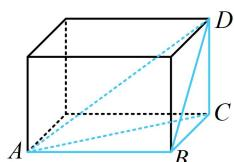

> [!faq]- 《第3节 外接球问题》参考答案
>
> > [!success]- **【答案】** $\frac{32\pi}{3}$
>
> > [!note]- **【分析】**
> > 本题未单列分析。
>
> > [!note]- **【解析】**
> > 解析：由 $\left\{ \begin{array}{l}BC\perp CD\\ AB\perp \text{平面} BCD \end{array} \right.$ 可发现有直角三角形和过其顶点的垂线段，故可按长方体模型处理，
> >
> > 如图， $BC = \sqrt{AC^2 - AB^2} = 2$ ， $CD = \sqrt{BD^2 - BC^2} = \sqrt{3}$
> >
> > 所以外接球的半径 $R = \frac{1}{2}\sqrt{AB^2 + BC^2 + CD^2} = 2$
> >
> > 体积 $V = \frac{4}{3}\pi R^3 = \frac{32\pi}{3}$
> >
> > 
