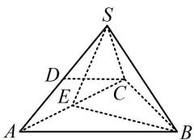
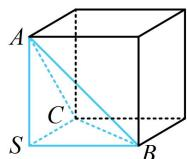

> [!faq]- 《第3节 外接球问题》参考答案
>
> > [!success]- **【答案】** $54\pi$
>
> > [!note]- **【分析】**
> > 本题未单列分析。
>
> > [!note]- **【解析】**
> > 解析：$SB\perp CD$ 怎么翻译？若知道正三棱锥对棱垂直的性质，则可结合它推出线面垂直，下面先证明一下，如图1，取 $AC$ 中点 $E$ ，连接 $SE$ ，BE，则 $SE\bot AC$ ， $BE\bot AC$ ，所以 $AC\bot$ 平面SBE，故 $SB\bot AC$ ，又 $SB\bot CD$ ，所以 $SB\bot$ 平面SAC，故 $SB\bot SA$ ，而正三棱锥三个侧面全等，所以SA，SB，SC两两垂直，有共顶点的两两垂直的棱，可按长方体模型处理，因为 $AB = BC = CA = 6$ ，所以 $SA = SB = SC = 3\sqrt{2}$ ，如图2，外接球半径 $R = \frac{1}{2}\sqrt{SA^2 + SB^2 + SC^2} = \frac{3\sqrt{6}}{2}$ 所以外接球的表面积 $S = 4\pi R^2 = 54\pi$ ：
> >
> >   
> > 图1
> >
> >   
> > 图2
>
> > [!tip]- **【反思】**
> > 本题放在这里，是希望没做出来的同学记住正三棱锥的性质.①正三棱锥的对棱垂直，值得熟悉；
> > - **②**：有时模型会隐藏在条件中，需要我们用所给条件作出一些推理才能发现模型特征.
