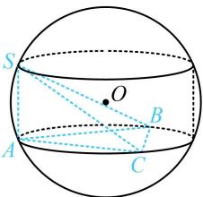

> [!faq]- 《第3节 外接球问题》参考答案
>
> > [!success]- **【答案】** 2
>
> > [!note]- **【分析】**
> > 本题未单列分析。
>
> > [!note]- **【解析】**
> > 解析：有线面垂直，且 $\triangle ABC$ 是等边三角形，属外接球的圆柱模型，核心方程是 $r^{2}+\left(\frac{h}{2}\right)^{2}=R^{2}$ ，
> > 如图，圆柱的高 h=SA，底面半径 r 即为 $\triangle ABC$ 的外接圆半径，所以 $r=3\times\frac{\sqrt{3}}{2}\times\frac{2}{3}=\sqrt{3}$ ，
> > 由题意，球的半径 R=2，因为 $r^{2}+\left(\frac{h}{2}\right)^{2}=R^{2}$ ，
> > 所以 $3+\left(\frac{h}{2}\right)^{2}=4$ ，解得：h=2，故SA=2。
> >
> > 
